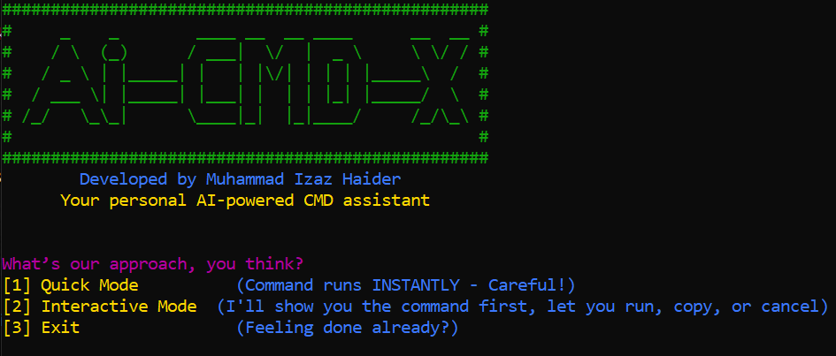

# ⚡ AI-CMD-X



**Developed by: Muhammad Izaz Haider**

> **Your AI-powered personal command wizard for Windows.**
>
> Speak in plain English — and watch real CMD magic happen instantly! 🪄

## 📚 What is AI-CMD-X?

**Tired of memorizing complex Windows commands?**

**AI-CMD-X** is a smart command-line assistant that **transforms your everyday English** into powerful Windows CMD instructions — powered by the mighty  **Google Gemini AI** .

But that’s not all!

✅ **Learn as you use** — ask things like *"What is ipconfig?"* and get simple, human-readable explanations.

✅ **Use aliases** — type shorter keywords instead of full commands to move even faster.

✅ **Quick Mode** for ultra-fast one-shot commands.

✅ **Interactive Mode** for reviewing, editing, and safely executing.

Whether you're a beginner, a tech enthusiast, or a pro hacker — **AI-CMD-X makes you faster, smarter, and unstoppable.**

## ✨ Key Features

* 🧠 **Plain English to Real CMD** — skip memorizing commands forever
* 🚀 **Quick Mode** — for lightning-fast command generation
* 🎯 **Interactive Mode** — for safe previewing, copying, or executing
* 📚 **Built-in Learning Mode** — explains commands simply when you ask
* 🛡️ **Auto-Save API Key** — securely inside `.env` file
* 🎨 **Colorful and Friendly Terminal Output** — beautiful and readable
* 🔙 **Smart 'Back' Navigation** — switch modes anytime smoothly
* 🎭 **Alias Support** — use nicknames or shortcuts for common tasks
* 🔮 **Future-Proof** — Voice commands and Linux support coming soon!

## 🚀 How AI-CMD-X Works

1. **First Time Setup**
   * Launch the tool.
   * It will ask you to enter your  **Gemini API key** .
   * API key is stored securely inside a hidden `.env` file (no need to enter it every time).
2. **Choose Your Style**
   * ⚡ **Quick Mode** — Type. Get instant command. Move fast.
   * 🎯 **Interactive Mode** — Review the command, edit if needed, choose to run/copy/cancel.
3. **Command Anything**
   * Some example prompts:
     * *"Who am I?"* (shows your username)
     * *"Show my IP address."*
     * *"List all Wi-Fi networks."*
     * *"Open the Downloads folder."*
     * *"Go up one directory."*
4. **Learn as You Go**
   * Want to learn too?
   * Ask:
     * *"What is ipconfig?"*
     * *"Explain netstat command."*
   * Instantly get simple, beginner-friendly explanations while working!
5. **Alias Power**
   * Save time by using short keywords — like *"ip"* instead of  *"show my IP address"* .
   * Aliases make your work even faster and cooler.
6. **Navigate Freely**
   * Type `back` anytime to return to mode selection.
   * You’re always in control.

## 🔥 Why Was AI-CMD-X Built?

[Check Out the Video Must.....](https://www.linkedin.com/posts/muhammad-izaz-haider-091639314_ai-cybersecurity-windows-activity-7322316845145833472-aTyS?utm_source=share&utm_medium=member_desktop&rcm=ACoAAE_T-C0BSzkVPAgz4Tm4DP5NBcgGPmL8Jhw)

## 🔥 Why Was AI-CMD-X Built?

Most people either fear the command line — or find it painfully slow.

I built AI-CMD-X to  **bridge the gap between human language and machine power** .

✅ It makes the terminal  **approachable for beginners** .

✅ It **accelerates professionals** who want speed and precision.

✅ It **teaches you** as you work — building your real IT skills over time.

AI-CMD-X isn’t just a tool —

**it’s your command-line superpower.** ⚡🛡️

# 🔧 Installation

### 1: 🔹 Must Install Required Modules

```sh
pip install google-generativeai python-dotenv
```

### 2: 🔹 Clone the Repository

```sh
git clone https://github.com/mizazhaider-ceh/Ai-CMD-X.git
cd Ai-CMD-X
```

### 3: 🔹 Run the Program

In Cmd:

```sh
python ai-cmd-x.py
```

### 3: 🔹 Enter your Gemini API key ~ when prompted

```sh
Done! 🚀
```

## 🛠️ Requirements

* Python 3.8+
* Gemini API Key (Get it [here](https://aistudio.google.com/apikey))

## 📚 Example Usage

| Input                     | Generated Command |
| ------------------------- | ----------------- |
| `Show my IP address`    | `ipconfig`      |
| `List all folders`      | `dir`           |
| `Open Downloads folder` | `cd Downloads`  |
| `Go one step back`      | `cd ..`         |

## 🛡️ Security

* API Key is stored **locally** in `.env`.
* Never exposed or sent elsewhere.

## 👨‍💻 Author

**Muhammad Izaz Haider**

* Ethical Hacker | Penetration Tester | Founder of **The Pentrix**
* [LinkedIn](https://www.linkedin.com/in/muhammad-izaz-haider-091639314/) • [GitHub](https://github.com/mizazhaider-ceh) • [PortFolio](https://mizazhaider-ceh.github.io/My-Portfolio/)

## 🌟 Support the Project

If you like  **Ai-CMD-X** , please **⭐ star the repo** and share it with your friends!

Your support keeps open-source alive! 🚀

# 🚀 Let Ai-CMD-X Make Your CMD Life Easy!

*"Speak simple. Work smart."*

*"Let AI turn your thoughts into commands!"* ✨
